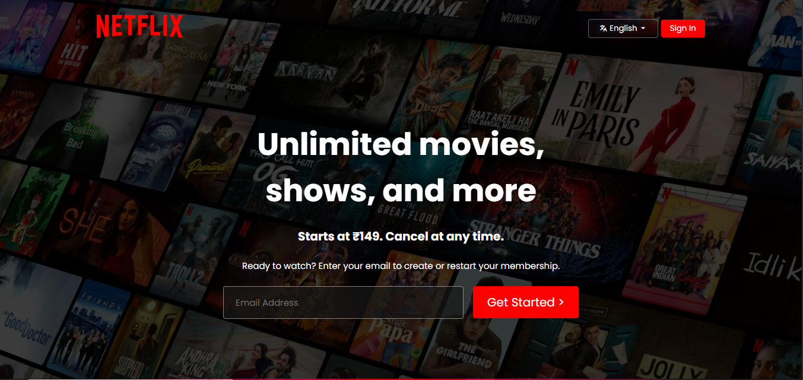

# 🎬 Netflix Clone

A responsive **Netflix landing page clone** built using **HTML5** and **CSS3**. This project recreates the look and feel of Netflix's official homepage with a modern UI, responsive design, and clean code structure.

> ⚠️ This project is created for educational purposes only and is not affiliated with or endorsed by Netflix.

---

## 🌐 Live Demo

https://primescreen.netlify.app/


---

## 📸 Screenshots


 

---

# ✨ Features

- 🎥 Netflix-inspired UI
- 📱 Fully Responsive Design
- 🖥️ Modern Landing Page
- 📺 Hero Banner Section
- ❓ FAQ Section
- 📧 Email Signup Form (UI)
- 🦶 Footer with Links
- ⚡ Smooth Layout
- 🎨 Clean and Organized Code

---

# 🛠️ Built With

- HTML5
- CSS3
- Flexbox
- CSS Grid

---

# 📂 Project Structure

```
Netflix_Clone
│
├── assets
│   └──images/
├── style.css
├── index.html
└── README.md
```

---

# 🚀 Getting Started

### Clone the Repository

```bash
git clone https://github.com/AshishPal80/Netflix_Clone.git
```

### Navigate to the Project

```bash
cd Netflix_Clone
```

### Run the Project

Simply open the `index.html` file in your browser.

OR

Run using **VS Code Live Server**.

---

# 📱 Responsive Design

The website is optimized for:

- 💻 Desktop
- 💼 Laptop
- 📱 Mobile
- 📲 Tablet

---

# 🎯 Learning Objectives

This project helped me practice:

- HTML Semantic Elements
- CSS Flexbox
- CSS Grid
- Responsive Web Design
- Media Queries
- Layout Design
- UI Cloning
- Clean Folder Structure

---

# 🚧 Future Improvements

- Add JavaScript Animations
- Login Page
- Signup Page
- Movie Cards Slider
- Video Preview
- Dark Mode Toggle
- Backend Integration
- Authentication
- API Integration

---

# 🤝 Contributing

Contributions are welcome!

1. Fork this repository

2. Create a new branch

```bash
git checkout -b feature-name
```

3. Commit your changes

```bash
git commit -m "Added new feature"
```

4. Push to GitHub

```bash
git push origin feature-name
```

5. Create a Pull Request

---

# 📄 License

This project is licensed under the **MIT License**.

---

# 👨‍💻 Author

**Ashish Pal**

GitHub: https://github.com/AshishPal80

---

# ⭐ Show Your Support

If you enjoyed this project, please consider giving it a ⭐ on GitHub!

It motivates me to build more exciting web development projects.

---

## 📌 Disclaimer

This project is a **frontend clone** of Netflix created solely for learning and portfolio purposes. All trademarks, logos, and copyrights belong to **Netflix**.